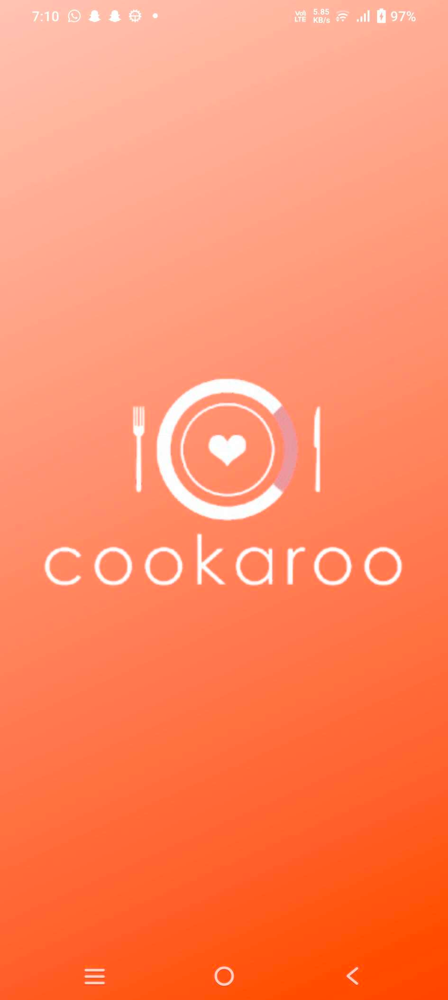

# Project - TravelMate

## Description

Cookaroo offers insights into the top 8 vegetarian dishes around the world, providing a detailed list of ingredients.It helps user Discover renowned dishes from various cultures.

## Key Features:

Top Dishes & Ingredients: 
The app features data on the top vegetarian dishes globally, showcasing key ingredients.
Modern Multi-Module Architecture: 
Built with the Multi Module Architecture and following Clean Architecture principles, ensuring efficient and scalable code.
Application is developed using Android XML designs
Interactive Display:
Displays the list of top dishes in a Horizontal Pager view, with detailed ingredient lists shown in an organized, easy-to-navigate layout.
Collapsible Layout for Enhanced Usability: The collapsible layout design enhances user experience, making it simple to view.
Dynamic Search with Pattern Matching: 
Includes a powerful search feature, enabling users to quickly find dishes based on ingredients or keywords with advanced pattern matching functionality.

## Screenshots

This project includes screenshots to provide a visual overview of the application. You can find them
in the [screenshots](/screenshots) directory.

Here are a few examples:

## Android Studio IDE Setup

For development, the latest version of Android Studio is required. The latest version can be
downloaded from [here](https://developer.android.com/studio)..

## Dependencies

This project leverages several Jetpack Compose libraries to build a modern Android UI:

* **androidx.activity:activity-compose:** This library is s part of the Jetpack Compose toolkit for
  Android, which provides a modern toolkit for building native Android UIs.

* **androidx.core:core-ktx:** Provides Kotlin extensions for core Android framework components.

* **androidx.lifecycle:lifecycle-runtime-ktx:** Offers Kotlin extensions for the Lifecycle
  components,enabling lifecycle-aware behavior in your composables.

* **androidx.compose.material3:material3-android:** The Material3 Design components library,
  offering a wide
  range of pre-built UI elements that adhere to Google's Material Design guidelines, ensuring a
  visually appealing and user-friendly interface.

* **androidx.navigation:navigation-compose:** This library provides Navigation Component support for
  Jetpack Compose Applications.

